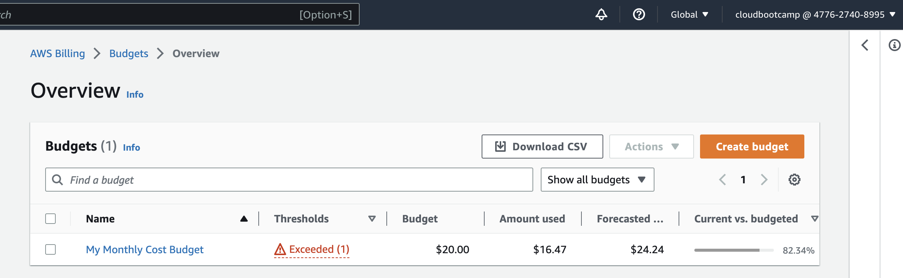
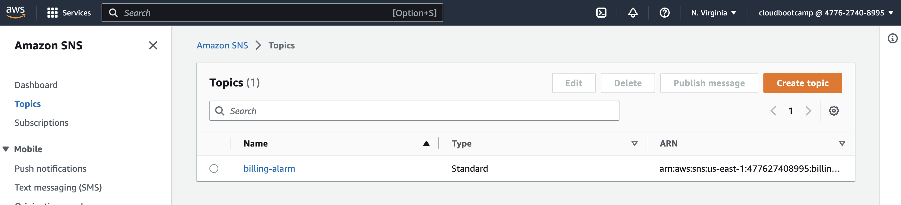
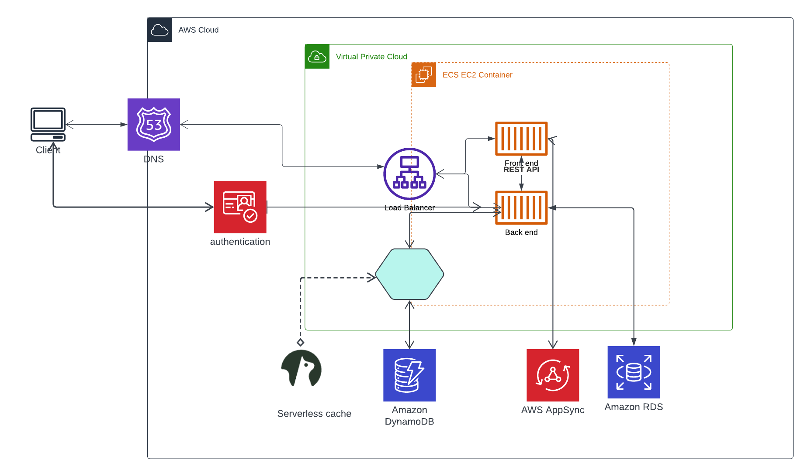

# Week 0 — Billing and Architecture

  ## Required Homework 
  
  ### Install AWS CLI 
  
  I was able to use gitpod and github code spespaces and able to integrate with aws cli .
  
  please find my configuration of the same.
 
 

### Budget threshold

i have created a budget threshold for 20USD and 25 USD

### Billing alarm

### app logical architecture diagram

please find the link for logical diagram

https://lucid.app/lucidchart/959cee0a-6ffa-48f6-b637-e7b1659099f4/edit?viewport_loc=-690%2C432%2C1865%2C792%2C0_0&invitationId=inv_c9c094b1-2e80-4d0e-9d62-555675dea1c4 

  
